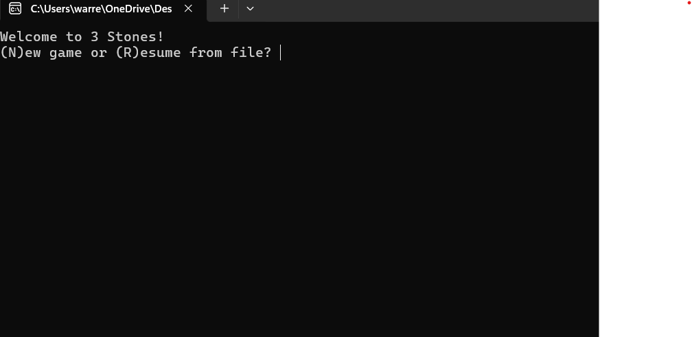
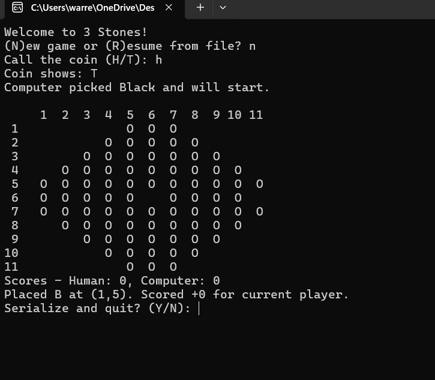
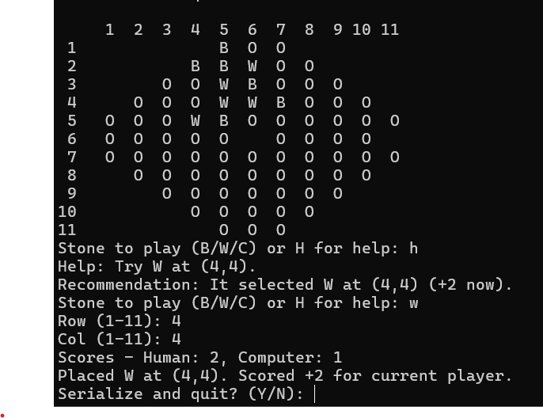

---
output:
  pdf_document: default
  html_document: default
---
# Project Manual — 3 Stones (Milestone 1)

## Bug Report
- Loading from the default serialization option (to save.txt) will occasionally fail to load. After multiple attmpts to recreate the crash that occured during my live presentation, I was unable to replicate the behavior exhibited in the failed load state of the file.

- The scoring algorithm weigh blocking moves heavily, with these blocking moves often outscoring moves that score points. Although not technically a bug, I felt it was worth noting due to the fact that during live demonstrations, this topic was brought up often.

## Screenshots

### Coin toss


### Human move


### Computer move


### Full board view


## Feature Report
### Missing (expected in later milestones)
- Advanced computer strategies.
- Help mode recommendations for the human player.
- Resume/load from file.
- Scoring logic for 3-in-a-row.


### Extra
- None implemented beyond requirements for Milestone 1.

## Data Structures / Classes
- **Board**: 11×11 octagon with 80 valid pockets, manages placement.
- **BoardView**: prints board with row/col numbers.
- **Move**: coordinate + stone struct.
- **Player (abstract)**: base for Human and Computer.
- **Human**: reads input, checks inventory.
- **Computer**: currently plays a random valid move.
- **Round**: manages turn order, legality, placement, updates last move.
- **Tournament**: tracks rounds won.
- **Serializer**: saves game state (load coming in Milestone 2).

## Log
See `project_log.md` (embed or append).

## How to Run
```bash
g++ src/*.cpp -std=c++17 -O2 -o three_stones
./three_stones

- Use the Serializer `save()` call (to be wired into menu) to write current state to a text file per the required format.

## Generative AI Assistance

I used generative AI (ChatGPT) in limited ways to support my development process:

- **Project Setup & Structure**  
  Helped outline a clean folder structure and starter C++ class skeletons to save time getting organized.  
  *(Category: design/documentation)*

- **Documentation Templates**  
  Assisted with creating the initial draft for the project manual and project log format.  
  *(Category: documentation)*

- **Coding Skeletons**  
  Supplied stubs for classes (Board, Player, Human, Computer, Round, Tournament, Serializer) so I could focus on filling in logic.  
  *(Category: coding skeletons, not final implementations)*

# 3 Stones — Manual (Milestone 2)

## Bug Report
- **Help mode edge case**: If no legal moves exist in the row/column tied to the opponent’s last move, the system may still attempt to suggest one before falling back. This does not break the game but can produce “Help not available” occasionally.
- **Rationale verbosity**: Computer’s rationale lines are simple (“Blocking opponent 3-in-a-row”) and may not always cover all scoring subtleties.
- **Serialization overwrite**: Saving always writes to `save.txt` unless another filename is hardcoded; no overwrite prompt is given.

## Feature Report
### Missing
- Long-term strategic planning (e.g., lookahead beyond immediate scoring opportunities).
- Sophisticated tie-breakers between equal candidate moves.

### Extra
- **Silent retry guard**: Computer retries up to 500 times silently if an illegal move is generated, preventing console spam.
- **Color-aware help mode**: Human’s help suggestions now always respect the human’s assigned color.
- **Move rationale**: Computer not only places stones but explains the strategy used.

## Classes / Data Structures
- **Board**: Manages the 11×11 pocket grid, placement legality, scoring windows.
- **BoardView**: Handles formatted printing of the board with row/column labels.
- **Round**: Enforces turn order, coin flip, color assignment, legality rules, move application.
- **Player**: Abstract base class for Human/Computer.
- **Human**: Prompts user for stone and coordinates, integrates help mode (`H`).
- **Computer**: Generates moves using strategy evaluation and assigns rationale.
- **Move**: Encapsulates stone played, coordinate, validity, rationale string.
- **Inventory**: Tracks each player’s stone counts, color, and score.
- **Serializer**: Saves/loads full game state to a text file.
- **Tournament**: Tracks cumulative round wins and identifies current leader.

## How to Run
From the project root:
```bash
g++ src/*.cpp -std=c++17 -O2 -o three_stones
./three_stones
Or using VS Code Build/Run (Ctrl+Shift+B on Windows).

At program start:

Choose (N)ew game or (R)esume.

Play alternates between computer and human until inventories are empty.

At the end of each turn, the user may choose to serialize and quit.

GenAI Assistance
Generative AI was used during development for:

Debugging C++ compile errors (missing brackets, type mismatches).

Designing helper utilities (help callback wiring, rationale field).

## Screenshots

### Screnshot 1


### Screnshot 2


### Screnshot 1


